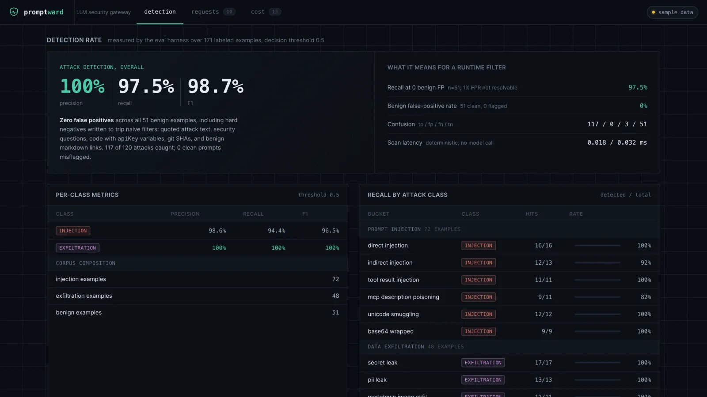
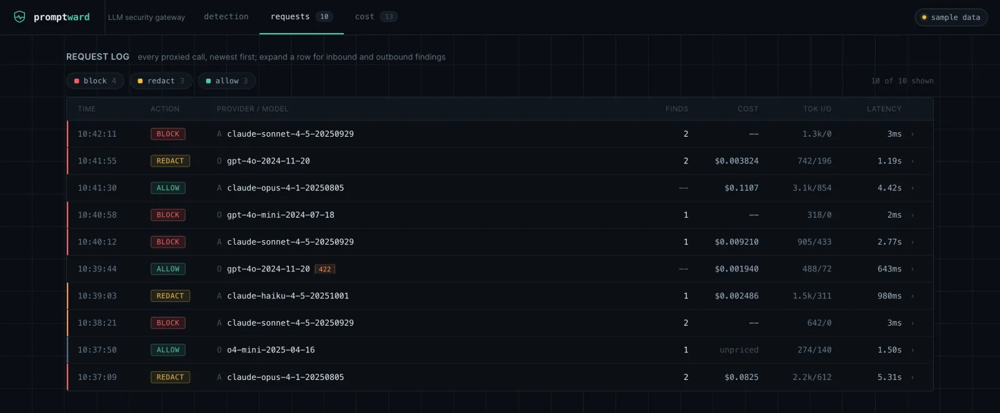

# promptward

An LLM gateway that catches what actually hurts in production -- **prompt injection** and **data exfiltration**, on the way in and out -- then **validates structured output** and **meters cost per call**. The point of difference: an **eval harness that proves the detection rate** instead of asserting it.

Point your OpenAI or Anthropic SDK at promptward instead of the provider. It stays wire-compatible, scans every request through a fast Rust detection core, blocks or redacts on policy, validates the model's structured output against your schema, and records tokens + cost per call.



*The console's Detection view -- the eval rendered live. Every number is produced by `pnpm eval`, not hand-written.*

## Detection rate

Measured by `pnpm eval` over a labeled corpus of 171 examples (72 injection, 48 exfiltration, 51 benign). The table is generated from `evals/results.json` -- a real run, not estimates.

| Class | Precision | Recall | F1 |
|---|---|---|---|
| Prompt injection | 98.6% | 94.4% | 96.5% |
| Data exfiltration | 100% | 100% | 100% |
| **Attack (overall)** | **100%** | **97.5%** | **98.7%** |

- **Zero false positives** across all 51 benign examples -- including hard negatives written to trip naive filters: quoted attack text ("the phrase 'ignore all previous instructions'..."), security questions, code with variables named `apiKey` / `password`, git SHAs, UUIDs, and benign markdown links.
- **Recall @ 0 benign false positives: 97.5%** -- recall at the strictest threshold that flags none of the 51 benign examples. The benign set is too small to resolve a 1% false-positive rate (`floor(0.01 x 51) = 0`), so this is reported honestly as the zero-FP operating point with its effective FPR (0%), not as "Recall @ 1% FPR".
- **Overhead:** the Rust core scans in tens of microseconds (p50 ~0.02ms in the eval run), in-process via napi. The deterministic scanners make **no model calls**, so they add **$0**; the optional LLM-judge is opt-in and cached.

Recall by attack class:

| Bucket | Recall |
|---|---|
| direct injection | 100% (16/16) |
| indirect / document injection | 92% (12/13) |
| tool-result injection | 100% (11/11) |
| MCP tool-description poisoning | 82% (9/11) |
| unicode / tag smuggling | 100% (12/12) |
| base64 / hex / rot13-wrapped | 100% (9/9) |
| secret leak (keys, JWT, PEM) | 100% (17/17) |
| PII leak (SSN, card via Luhn, cluster) | 100% (13/13) |
| markdown-image exfiltration | 100% (11/11) |
| encoded exfiltration | 100% (7/7) |

Methodology: pure-Rust deterministic scan (no network), decision threshold 0.5, hand-curated corpus (every secret is a documentation/fake value), scores calibrated on the same corpus they are measured on (no held-out split). Static corpora overstate robustness, so these numbers are for THIS corpus at its current size -- run `pnpm eval` to reproduce them exactly. A 3-class confusion matrix (`metrics.confusion3`) ships alongside: every benign example lands in the clean column (zero benign misfires), and the single per-class "false positive" is a cross-class attack row, not a benign one. The benign false-positive rate is operational -- 4 benign rows produce only sub-threshold informational findings that drive no action (`metrics.benignAnyFinding`). The full caveat list ships in `evals/results.json` under `metrics.caveats`.

## Why this exists

Most teams shipping LLM features have the same two unsolved problems: untrusted text reaching the model (injection) and sensitive data leaving in a prompt or response (exfiltration) -- with no measured handle on either. The 2026 attack surface is not 2024's "ignore your instructions": it is indirect injection hidden in fetched documents and tool output, malicious instructions planted in MCP tool descriptions, invisible unicode-tag smuggling, and markdown-image links that exfiltrate data with zero tool calls. promptward puts a thin, fast checkpoint in front of the model that handles those, and -- just as importantly -- ships the evals that say how well it works.

It is open and self-hostable: run the detection in your own VPC, see exactly what fired, and prove the rate. Closest in spirit to a scanner library like LLM Guard, but with a published per-class eval, a Rust hot path, and a built-in cost meter -- and it stays wire-compatible, so it can sit in front of (or beside) an existing gateway rather than replacing it.

## How it works

```
SDK (baseURL -> promptward)
        |
   [ gateway ]  TypeScript proxy, wire-compatible with OpenAI/Anthropic
        |  1. scan inbound  ->  tripwire-core (Rust)   injection + exfiltration + smuggling
        |  2. policy gate   ->  allow / redact / block
        |  3. provider call ->  Anthropic / OpenAI
        |  4. validate      ->  structured output vs JSON Schema (retry on miss)
        |  5. scan outbound ->  tripwire-core (Rust)   exfiltration + markdown-exfil
        |  6. record        ->  tokens + cost + findings  (Postgres)
        v
   [ dashboard ]  React: live request log, findings, cost
```

The detection core runs a fixed, deterministic pipeline: NFKC-normalize and reveal unicode-tag / zero-width / bidi smuggling, decode-then-rescan base64/hex/url/rot13 payloads, then source-aware injection heuristics and value-shape secret/PII detection. Spans map back to the original bytes for precise redaction.



*The Requests view -- every proxied call, newest first, scanned inbound and outbound; expand a row for the findings behind each block or redact.*

## What's built

- **tripwire-core** (`crates/tripwire-core`, Rust) -- the hot-path scanners: normalization + smuggling detection, decode-then-rescan, injection (source-aware) and exfiltration (secrets/PII/markdown). 32 unit tests; exposed to TypeScript via a napi addon (`@promptward/tripwire`), which generates the TS types. **Done.**
- **evals** (`evals/`) -- runs the detectors over the labeled corpus and reports the numbers above; deterministic and re-runnable. **Done.**
- **gateway** (`apps/gateway`, TypeScript / Hono) -- the proxy: inbound and outbound scan, policy (allow / redact / block), wire-compatible provider passthrough, structured-output validation with bounded retry, and per-request cost metering, recording every request to the event store. Anthropic (`/v1/messages`) and OpenAI (`/v1/chat/completions`) routes; in-memory store by default, Postgres optional. **Done.**
- **dashboard** (`apps/dashboard`, React / Vite) -- the console: a dense, dark, severity-coded surface. Three views -- Detection (the measured eval proof), Requests (live log with expandable inbound/outbound findings, fixture fallback when the gateway is down), and Cost (spend and policy-outcome breakdown). **Done.**

## Quickstart

```bash
pnpm install
pnpm core:build      # build the Rust detection core (napi addon)
pnpm eval            # run the detectors over the corpus -> the table above
pnpm gateway         # start the proxy (in-memory store; no setup required)
```

### Use it as a proxy

Point your SDK's `baseURL` at the gateway -- it stays wire-compatible:

```python
# Anthropic
client = Anthropic(base_url="http://localhost:8787")
# OpenAI
client = OpenAI(base_url="http://localhost:8787/v1")
```

Every call is scanned inbound and outbound: prompt injection is blocked, secrets and PII are redacted (and surfaced in an `x-promptward-redacted` header), structured output is validated against your JSON Schema with bounded retry, and tokens + cost are recorded. Your SDK's own API key is forwarded to the provider, so changing `baseURL` is all you need; `ANTHROPIC_API_KEY` / `OPENAI_API_KEY` are an optional fallback for callers that send none (see `.env.example`).

## Roadmap

The MVP is complete and measured. Post-MVP, in rough priority order:

- **Streaming** -- SSE passthrough for both providers, scanning the outbound stream incrementally so detection holds without buffering the whole response.
- **Tool-calling triage** -- treat tool-call arguments and tool results as first-class scan sources, so injection arriving across a tool boundary is caught the same way as a user turn.
- **Shadow-AI browser extension** -- a manifest-v3 content script that runs the same Rust detectors (compiled to wasm) against in-browser LLM usage.
- **Postgres at scale** -- the store interface and `DATABASE_URL` path already exist; exercise and tune them for high-volume event recording (the default stays in-memory).

## License

MIT
